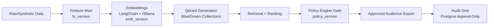

# Audience Engine

Audience Engine is an open-source bank customer ranking and similarity platform for campaign audience construction. It solves the operational gap between raw customer data and compliant targeting by combining governed feature snapshots, GPU-capable LLM embeddings, vector retrieval, ranking, policy gating, and auditable export into one versioned workflow.

## Key Features

- GPU-capable embedding pipeline using LangChain + Ollama (`langchain-ollama`)
- Qdrant vector search as the default retrieval backend
- Blue/green index lifecycle with generation build, validate, promote, and rollback
- Mandatory policy-engine gate before export
- Governance versioning via `VersionBundle` (`fs_version`, `emb_version`, `policy_version`, index alias/generation, run/campaign ids)
- Audit sink with append-only Postgres records for run, selected audience, and rejection summary

## Architecture



### Components

- Data + feature pipeline: `pipelines/minimal_slice/synthetic_data.py`, `feature_mart.py`
- Embedding pipeline: `pipelines/minimal_slice/embedding.py`
- Index lifecycle: `pipelines/minimal_slice/qdrant_index.py`
- Retrieval API: `services/retrieval_api/app.py` (`POST /v1/retrieve`)
- Ranking + policy + export orchestration: `pipelines/minimal_slice/run_flow.py`
- Policy registry: `governance/policies/policy_registry.yaml`
- Governance contracts and dictionaries: `governance/`
- Audit tables and infra: `infra/postgres/init/001_audit_sink.sql`, `infra/postgres/init/002_index_generations.sql`

## Quickstart (Dev)

Prereqs:
- Python 3.11+
- `uv`
- Docker + Docker Compose

From repo root:

```bash
make up
make bootstrap
make seed
make build-index
make demo
```

What this does:
- `make up`: starts local dev infrastructure
- `make bootstrap`: creates `.venv` and installs runtime/dev deps
- `make seed`: generates synthetic customers
- `make build-index`: builds feature mart + embeddings + Qdrant generation
- `make demo`: runs retrieval -> policy -> export -> audit flow

## Example Workflow

Scenario:
- `product=credit`
- `request_size=5000`

End-to-end intent:
1. Retrieval: fetch candidates from vector index (`product_line=credit_card`)
2. Ranking: score/sort by similarity
3. Policy: enforce suppressions/eligibility/risk/quota/conflicts
4. Export: write only approved audience rows

### 1) Retrieval API (implemented)

Start API:

```bash
make retrieval-api
```

Retrieve credit candidates:

```bash
curl -sS -X POST http://localhost:8000/v1/retrieve \
  -H "Content-Type: application/json" \
  -d '{
    "top_k": 200,
    "query_customer_id": "cust_00000",
    "product_line": "credit_card",
    "region_codes": ["us_west","us_central","us_east"],
    "segment_ids": ["mass","affluent","student","smb"],
    "min_tenure_months": 3,
    "max_delinquency_12m_count": 2,
    "fs_version": "fs_credit_v1",
    "policy_version": "policy_credit_v1"
  }'
```

Sample response (short):

```json
{
  "count": 200,
  "results": [
    {"customer_id": "cust_00123", "score": 0.921, "payload": {"product_line": "credit_card"}}
  ]
}
```

### 2) Policy API (contract from spec)

The policy service contracts are documented in `docs/POLICY_ENGINE_SPEC.md`.

```bash
curl -sS -X POST http://localhost:8080/v1/policy/evaluate \
  -H "Content-Type: application/json" \
  -d '{
    "request_id": "req-20260226-001",
    "run_id": "run-20260226-001",
    "campaign_id": "cmp-credit-2026q1",
    "channel": "email",
    "versions": {
      "fs_version": "fs_credit_v1",
      "emb_version": "fs_credit_v1+prompt_credit_v1+nomic-embed-text",
      "policy_version": "policy_credit_v1",
      "index_alias": "audience-serving",
      "index_version": "customers_fs_credit_v1_384d_20260226090000"
    },
    "inputs": {"candidate_set_ref": "retrieval://cmp-credit-2026q1"},
    "options": {"fail_closed": true, "max_reasons_per_customer": 5}
  }'
```

Sample response (short):

```json
{
  "summary": {"total_candidates": 5000, "approved_count": 4120, "rejected_count": 880},
  "results": [
    {"customer_id": "cust_00123", "decision": "approve"},
    {"customer_id": "cust_00999", "decision": "reject", "reasons": [{"reason_code": "SUPPRESS_DNC"}]}
  ]
}
```

### 3) Export (demo pipeline)

```bash
make demo
```

Sample output artifacts:
- `data/minimal_slice/run/approved_audience.jsonl`
- `data/minimal_slice/run/run_summary.json`

## Data Governance and Safety

- No PII in embeddings, prompts, or logs
- Embedding inputs are allowlist-only governed features
- Runtime lineage is carried in a `VersionBundle` with:
  - `fs_version`
  - `emb_version`
  - `policy_version`
  - `index_alias`
  - `concrete_qdrant_collection`
  - `run_id`
  - `campaign_id`
- Preflight validation checks policy/version compatibility and PII violations before downstream steps

## Index Lifecycle (Blue/Green)

Lifecycle commands:

```bash
make build-index
make validate-index
make promote-index
make rollback-index
```

How updates work:
- Build a new generation collection (`customers_{emb_version}_{dimension}d_{generation}`)
- Validate count/query/vector integrity
- Promote by atomic alias switch
- Roll back alias to previous generation if post-promotion checks fail

## Policy Engine

Why it exists:
- Prevents non-compliant export by enforcing suppressions, eligibility, risk, quota, and conflict rules before delivery.

How to update policies:
1. Edit `governance/policies/policy_registry.yaml`
2. Add/update reason bindings in `governance/dictionaries/reason_codes.yaml`
3. Bump `policy_version` for semantic changes
4. Run contract and unit tests:

```bash
make test-contracts
make test-unit
```

## Testing and Benchmarks

Tests:

```bash
make test-unit
make test-contracts
make test-integration-smoke
make test-integration-gpu
```

Benchmarks:

```bash
make bench-small
make bench-medium
```

Direct benchmark harness:

```bash
uv run python -m pipelines.minimal_slice.benchmark_harness \
  --num-points 500000 \
  --vector-size 384 \
  --num-queries 400 \
  --top-k 20 \
  --batch-size 2000 \
  --seed 42
```

## Roadmap

### v0.1.0

- OSS baseline release
- Minimal vertical slice: seed -> features -> embeddings -> retrieval -> policy -> export -> audit
- Retrieval API (`/healthz`, `/v1/retrieve`)
- Governance/policy/index lifecycle docs and contracts

### v0.2.0

- Production hardening for 10M+ readiness
- Full blue/green lifecycle operationalization with stricter promotion safety
- Expanded registry-driven policy runtime behavior and decision explainability
- Stronger immutable audit lineage and observability/benchmark evidence

## Contributing

- Guide: [CONTRIBUTING.md](CONTRIBUTING.md)
- Security policy: [SECURITY.md](SECURITY.md)
- Code of conduct: [CODE_OF_CONDUCT.md](CODE_OF_CONDUCT.md)
- Release checklist: [RELEASE_CHECKLIST.md](RELEASE_CHECKLIST.md)

## License

[MIT](LICENSE)
