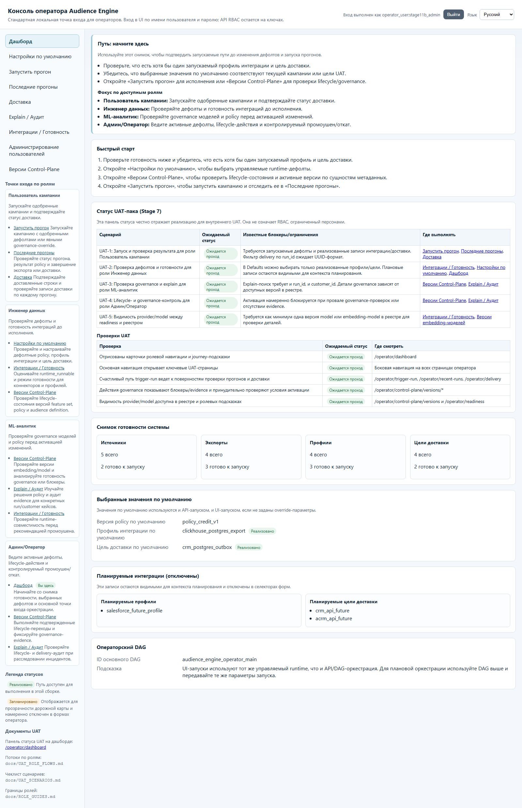
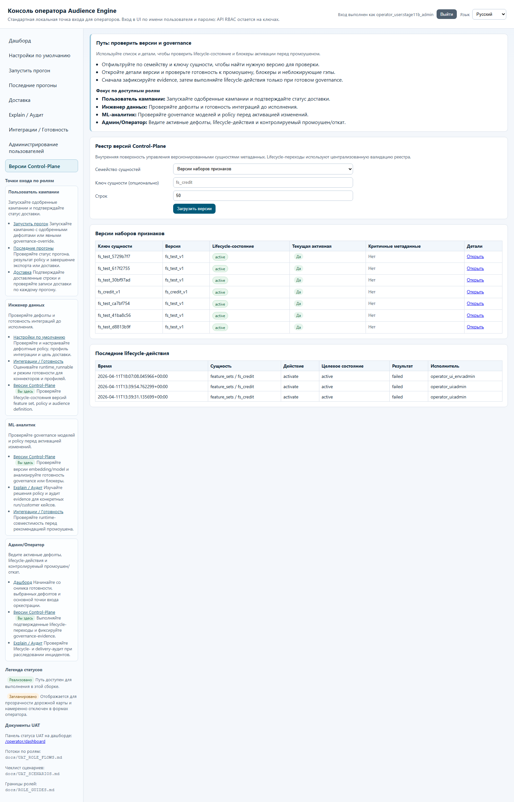
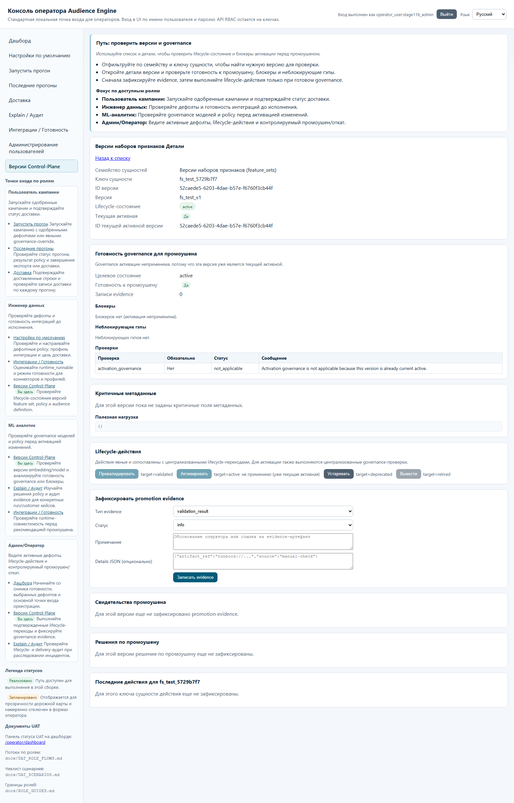
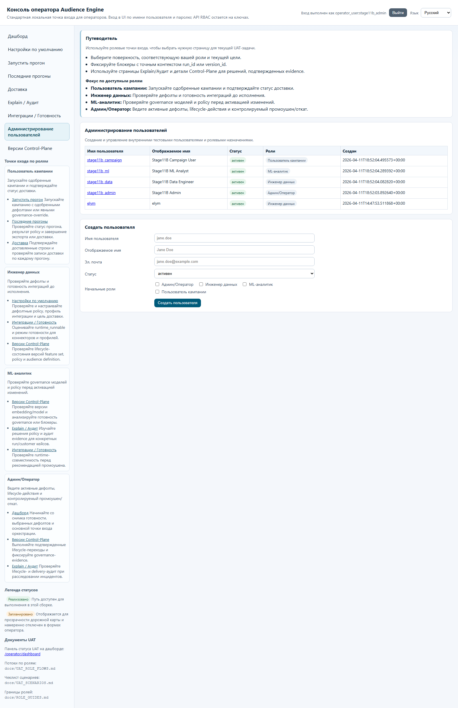
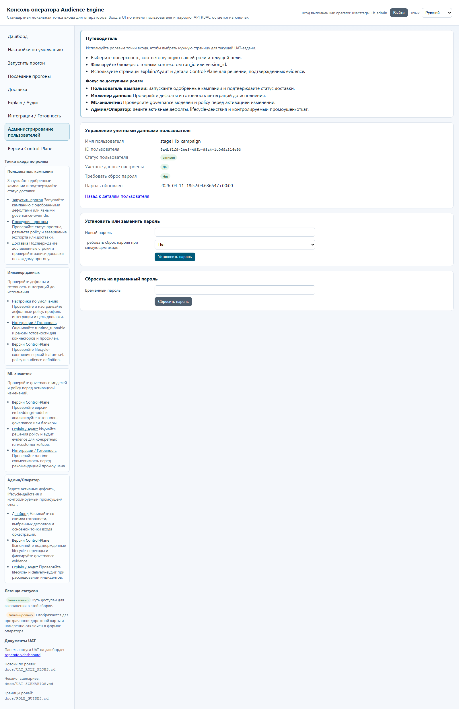

# Гайд роли: Админ/Оператор

## Кто это
Владелец операционного контура: lifecycle-переходы, governance-решения, user/role/password администрирование, контроль инцидентов.

## Какие страницы использовать
- `/operator/dashboard`
- `/operator/control-plane/versions`
- `/operator/explain-audit`
- `/operator/readiness`
- `/operator/defaults`
- `/operator/admin/users`
- `/operator/admin/users/{user_id}/credentials`

## Happy-path
1. Откройте `/operator/dashboard`, проверьте `Снимок готовности системы`.
2. Перейдите в `/operator/readiness`, подтвердите `runtime_runnable=true` для нужных профилей/целей.
3. Откройте `/operator/defaults`, сохраните рабочие дефолты policy/profile/target.
4. На `/operator/control-plane/versions` выберите семейство сущностей и откройте detail версии.
5. На detail-странице проверьте `promotion_ready`, `blockers`, `checks`.
6. Если нужно, запишите evidence через форму `Зафиксировать promotion evidence`.
7. Выполните lifecycle-действие (`Validate`, `Activate`, `Deprecate`, `Retire`) при разрешенном состоянии.
8. Проверьте `Решения по промоушену` и `Последние lifecycle-действия`.
9. Для администрирования людей: `/operator/admin/users` -> карточка пользователя -> credentials.

## Частые блокеры и что они значат
- `Promotion blocked: ...` на detail-странице:
- governance не готово, нельзя активировать версию.
- `runtime_runnable=false` на `/operator/readiness`:
- текущая конфигурация/интеграция не готова к запуску.
- Ошибки в `details_json must be valid JSON`:
- неверный JSON в форме evidence.
- `/operator/forbidden`:
- пользователь вошел, но роль не имеет доступа к странице/действию.

## Что НЕ делать
- Не активировать версии с `promotion_ready=No` и непрочитанными blockers.
- Не менять defaults перед запуском без проверки readiness.
- Не выполнять user/password операции вне `/operator/admin/users*`.

## Эскалация
- Readiness/интеграции: к роли Инженер данных.
- Модельные/policy-рекомендации: к роли ML-аналитик.
- Бизнес-контекст кампании и приоритеты прогона: к Пользователю кампании/владельцу кампании.

## Слоты скриншотов
| Slot | Route | Asset | Статус |
| --- | --- | --- | --- |
| AO-01 | `/operator/dashboard` | `images/admin-dashboard.png` | Captured (live) |
| AO-02 | `/operator/control-plane/versions` | `images/admin-control-plane-versions.png` | Captured (live) |
| AO-03 | `/operator/control-plane/versions/{entity_type}/{entity_key}/{version_id}` | `images/admin-control-plane-detail.png` | Captured (live) |
| AO-04 | `/operator/admin/users` | `images/admin-user-admin-list.png` | Captured (live) |
| AO-05 | `/operator/admin/users/{user_id}/credentials` | `images/admin-user-credentials.png` | Captured (live) |

## Проверено vs не проверено
Проверено в runtime (2026-04-11): доступность маршрутов и RU-лейблы навигации.
Проверено по коду: admin имеет доступ к `operator.user_admin.manage`, `operator.user_credentials.manage`, lifecycle transitions и evidence.
Проверено live-capture (2026-04-11): все слоты AO-01..AO-05 сняты с логином `admin_operator`.
