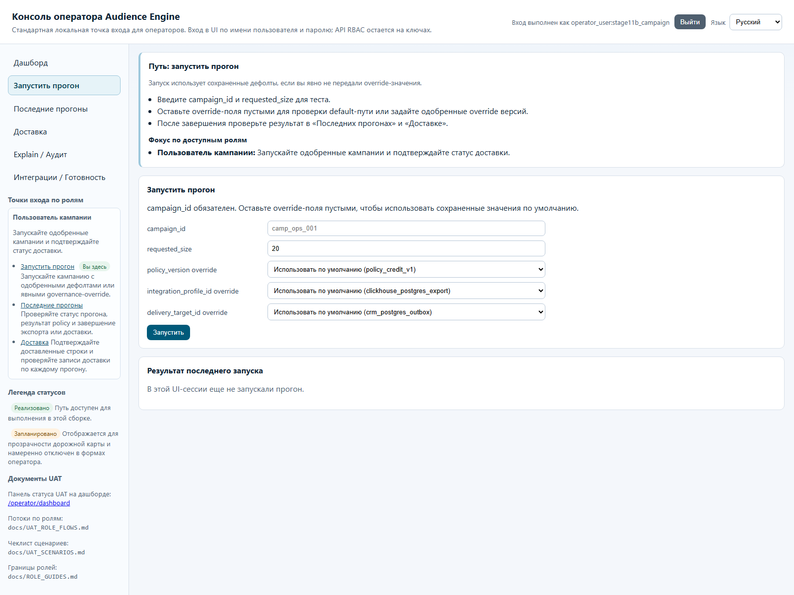
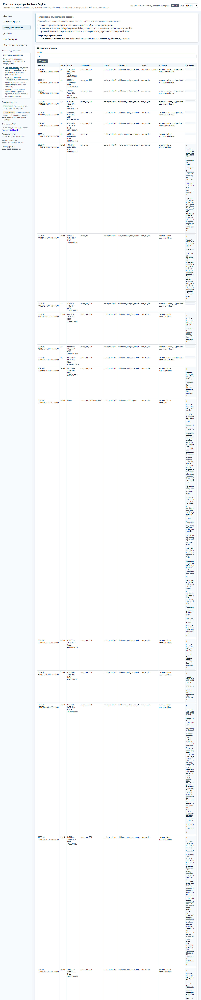
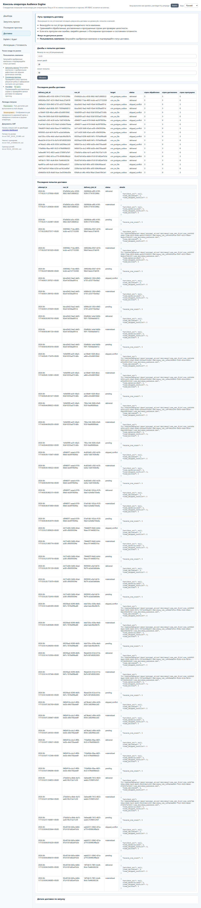
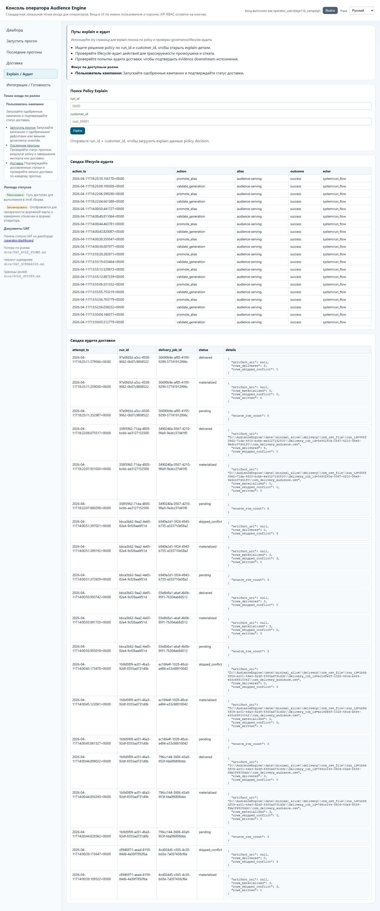

# Гайд роли: Пользователь кампании

## Кто это
Запускает кампании в рамках одобренных дефолтов, отслеживает результат прогона и доставку.

## Какие страницы использовать
Основные:
- `/operator/trigger-run`
- `/operator/recent-runs`
- `/operator/delivery`

Дополнительно (чтение/контекст):
- `/operator/dashboard`
- `/operator/explain-audit`
- `/operator/readiness`

## Happy-path
1. На `/operator/dashboard` убедитесь, что общий контур готов.
2. На `/operator/trigger-run` заполните `campaign_id` и `requested_size`.
3. Оставьте override пустыми, если работаете по утвержденным defaults.
4. Запустите прогон (`Запустить`).
5. На `/operator/recent-runs` проверьте строку прогона и `status`.
6. На `/operator/delivery` отфильтруйте по `run_id`, проверьте jobs/attempts/records.
7. Если нужно объяснение решения policy, используйте `/operator/explain-audit`.

## Частые блокеры и что они значат
- `campaign_id is required`:
- не заполнен обязательный идентификатор кампании.
- Ошибка `requested_size must be ...`:
- размер вне допустимого диапазона 1..500.
- `status=failed` или `last_failure` в Recent Runs:
- прогон завершился с ошибкой, требуется разбор причины.
- `Invalid run_id format` на Delivery/Explain:
- передан не-UUID `run_id`.

## Что НЕ делать
- Не менять defaults и lifecycle-состояния версий.
- Не использовать страницы user/credentials администрирования.
- Не продолжать массовые запуски при повторяющемся `failed` без эскалации.

## Эскалация
- Ошибки readiness/defaults/integration: к Инженеру данных.
- Вопросы governance/policy объяснений: к ML-аналитику.
- Решение по активации/rollback и операционные инциденты: к Админу/Оператору.

## Слоты скриншотов
| Slot | Route | Asset | Статус |
| --- | --- | --- | --- |
| CU-01 | `/operator/trigger-run` | `images/campaign-trigger-run.png` | Captured (live) |
| CU-02 | `/operator/recent-runs` | `images/campaign-recent-runs.png` | Captured (live) |
| CU-03 | `/operator/delivery` | `images/campaign-delivery.png` | Captured (live) |
| CU-04 | `/operator/explain-audit` | `images/campaign-explain-audit.png` | Captured (live) |

## Проверено vs не проверено
Проверено в runtime (2026-04-11): страницы trigger-run/recent-runs/delivery/explain/readiness доступны в RU UI.
Проверено по коду: campaign_user может `operator.trigger_run.submit`, но не имеет доступа к defaults/control-plane/users.
Проверено live-capture (2026-04-11): все слоты CU-01..CU-04 сняты с логином `campaign_user`.
