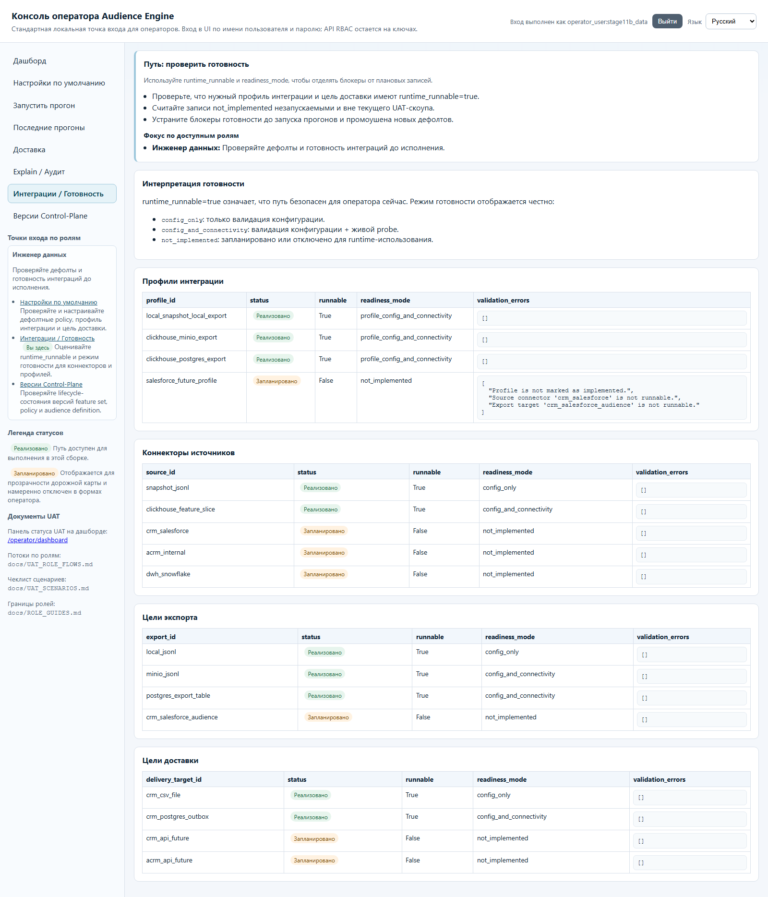
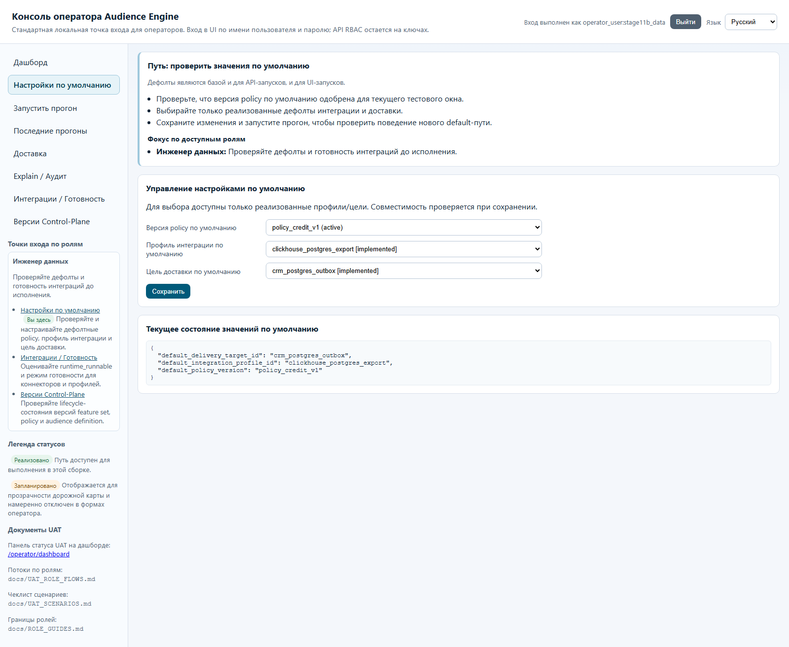
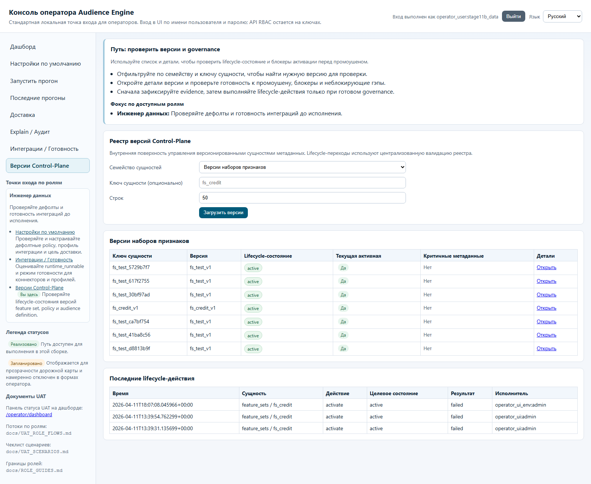
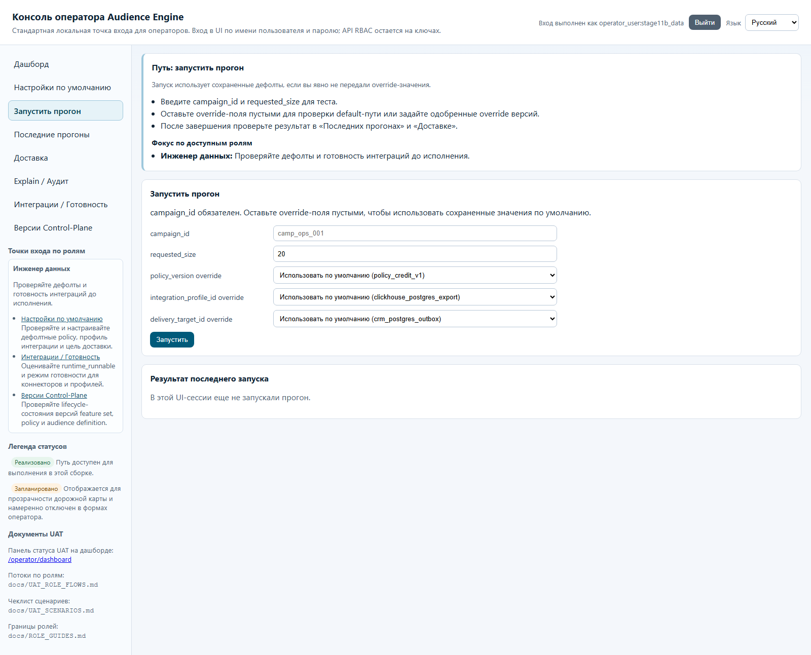

# Гайд роли: Инженер данных

## Кто это
Отвечает за готовность интеграций и корректные runtime-дефолты для стабильного запуска.

## Какие страницы использовать
Основные:
- `/operator/readiness`
- `/operator/defaults`
- `/operator/control-plane/versions`

Операционные проверки результата:
- `/operator/trigger-run`
- `/operator/recent-runs`
- `/operator/delivery`

## Happy-path
1. На `/operator/readiness` проверьте профили, источники, экспорты, цели доставки.
2. Убедитесь, что целевой путь имеет `runtime_runnable=true`.
3. На `/operator/defaults` выберите реализованные (`Реализовано`) policy/profile/target и сохраните.
4. На `/operator/control-plane/versions` проверьте lifecycle-состояния нужных сущностей.
5. При необходимости запустите проверочный прогон на `/operator/trigger-run`.
6. Подтвердите итог на `/operator/recent-runs` и `/operator/delivery`.

## Частые блокеры и что они значат
- `runtime_validation_errors` в таблицах readiness:
- конфигурация не проходит проверки готовности.
- Ошибка сохранения defaults:
- выбран невалидный или неготовый идентификатор policy/profile/target.
- Ошибка запуска на `/operator/trigger-run`:
- входные параметры кампании/размера или data-quality предусловия не выполнены.

## Что НЕ делать
- Не выбирать `Запланировано (planned)` как рабочий путь исполнения.
- Не выполнять lifecycle-переходы версий (это зона Админа/Оператора).
- Не заходить в user/credentials администрирование как рабочий поток роли.

## Эскалация
- Lifecycle activation/rollback: к Админу/Оператору.
- Governance/модельные доказательства: к ML-аналитику.
- Бизнес-параметры кампании: к Пользователю кампании.

## Слоты скриншотов
| Slot | Route | Asset | Статус |
| --- | --- | --- | --- |
| DE-01 | `/operator/readiness` | `images/data-readiness.png` | Captured (live) |
| DE-02 | `/operator/defaults` | `images/data-defaults.png` | Captured (live) |
| DE-03 | `/operator/control-plane/versions` | `images/data-control-plane-versions.png` | Captured (live) |
| DE-04 | `/operator/trigger-run` | `images/data-trigger-run.png` | Captured (live) |

## Проверено vs не проверено
Проверено в runtime (2026-04-11): маршруты, RU-лейблы, форма defaults/readiness pages.
Проверено по коду: `operator.defaults.update` и `operator.trigger_run.submit` доступны data_engineer; lifecycle transition недоступен.
Проверено live-capture (2026-04-11): все слоты DE-01..DE-04 сняты с логином `data_engineer`.
