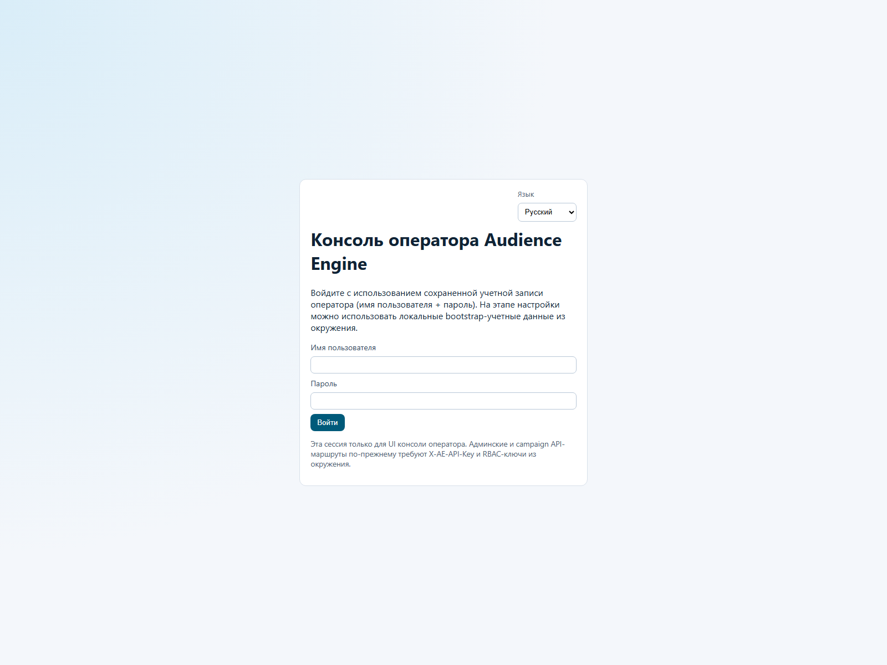
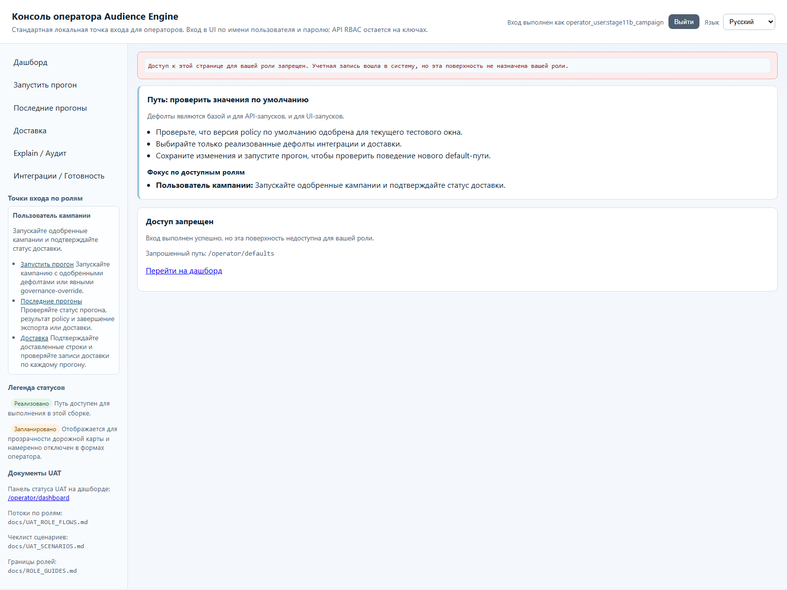

# Первые 15 минут в AudienceEngine

## Для кого
Любая внутренняя роль: Админ/Оператор, Инженер данных, ML-аналитик, Пользователь кампании.

## Шаги (happy-path)
1. Откройте `/operator/login`, войдите по username/password.
2. В правом верхнем углу выберите язык `Русский` (Language -> Русский).
3. Перейдите на `/operator/dashboard` и проверьте блоки:
- `Быстрый старт`
- `Статус UAT-пака (Stage 7)`
- `Снимок готовности системы`
4. В левом меню откройте нужный стартовый экран по роли:
- Админ/Оператор: `/operator/control-plane/versions`
- Инженер данных: `/operator/readiness` -> `/operator/defaults`
- ML-аналитик: `/operator/control-plane/versions` -> `/operator/explain-audit`
- Пользователь кампании: `/operator/trigger-run`
5. Если не хватает прав, система отправит на `/operator/forbidden` с пояснением причины.

## Как читать ключевые статусы
- `Реализовано / Запланировано`: статус реализации сущности/интеграции.
- `runtime_runnable=true/false`: можно ли безопасно запускать текущий путь прямо сейчас.
- `lifecycle_state`: состояние версии в реестре (например `draft`, `validated`, `active`).
- `promotion_ready=Yes/No`: готовность к промоушену на detail-странице Control-Plane.
- `status`, `export_status`, `delivery_status` на `/operator/recent-runs`: итог исполнения прогона.

## Где искать помощь в UI
- Блок `Точки входа по ролям` (sidebar).
- Блок `Путь: ...` на каждой странице (journey guidance).
- UAT-документы в sidebar:
- `docs/UAT_ROLE_FLOWS.md`
- `docs/UAT_SCENARIOS.md`
- `docs/ROLE_GUIDES.md`

## Слоты скриншотов
| Slot | Route | Asset | Статус |
| --- | --- | --- | --- |
| QS-01 | `/operator/login` | `images/qs-login-ru.png` | Captured (live) |
| QS-02 | `/operator/dashboard` | `images/qs-dashboard-ru.png` | Captured (live) |
| QS-03 | `/operator/forbidden` | `images/qs-forbidden-campaign.png` | Captured (live) |

## Проверено vs не проверено
Проверено в runtime (2026-04-11): `/operator/login`, `/operator/language`, `/operator/dashboard`, `/operator/forbidden`, RU-названия пунктов меню.
Проверено live-capture (2026-04-11): все три слота QS-01..QS-03.
