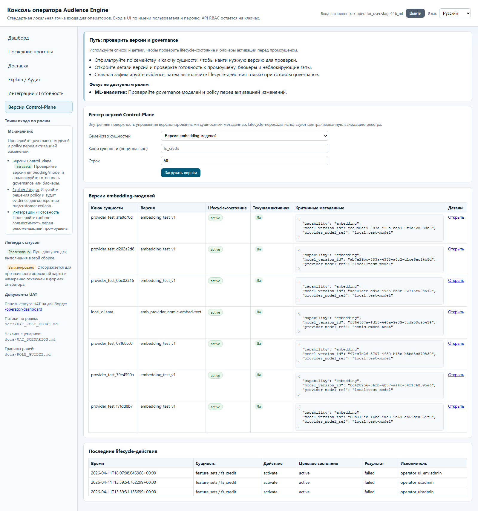
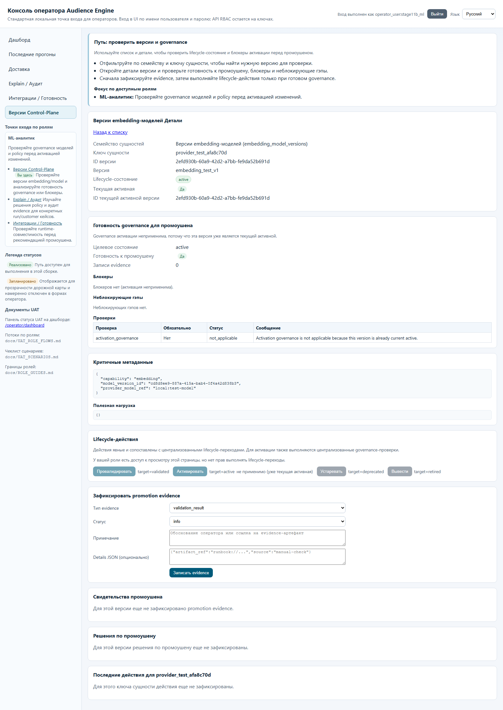
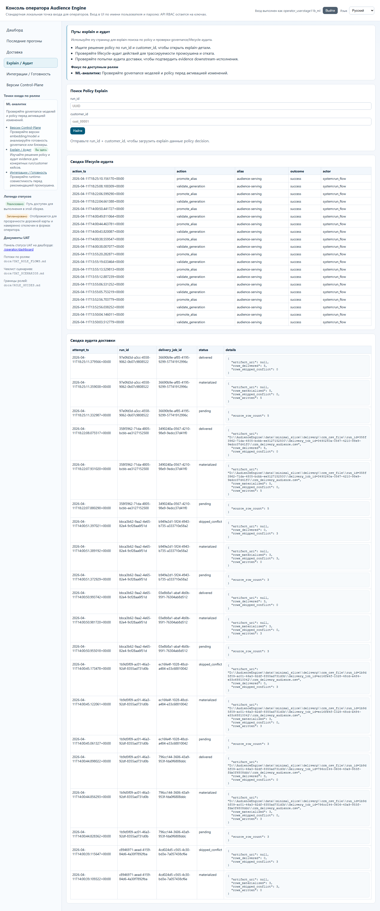
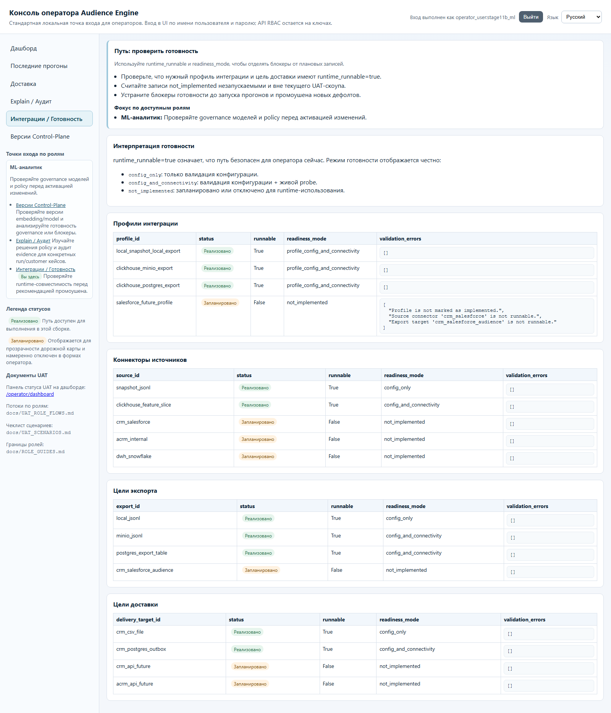

# Гайд роли: ML-аналитик

## Кто это
Отвечает за оценку model/embedding/policy изменений и governance-обоснование перед активацией.

## Какие страницы использовать
- `/operator/control-plane/versions`
- `/operator/control-plane/versions/{entity_type}/{entity_key}/{version_id}`
- `/operator/explain-audit`
- `/operator/readiness`

Поддерживающие страницы наблюдения:
- `/operator/recent-runs`
- `/operator/delivery`

## Happy-path
1. На `/operator/control-plane/versions` выберите `embedding_model_versions` или нужное семейство.
2. Откройте detail-страницу версии, проверьте `promotion_ready`, `checks`, `blockers`, `non_blocking`.
3. При необходимости зафиксируйте evidence через форму `Зафиксировать promotion evidence`.
4. На `/operator/explain-audit` выполните lookup по `run_id + customer_id`.
5. Сверьте lifecycle/delivery-аудит и подготовьте рекомендацию Админу/Оператору.

## Частые блокеры и что они значат
- Read-only текст в блоке lifecycle actions:
- роль видит страницу, но не может делать lifecycle transition.
- `Provide both run_id and customer_id` на explain:
- для поиска нужны оба параметра.
- `Invalid run_id format (expected UUID)`:
- неверный формат `run_id`.
- `details_json must be valid JSON` при записи evidence:
- неправильный JSON в деталях evidence.

## Что НЕ делать
- Не пытаться выполнить `Activate/Deprecate/Retire` (это admin-only action).
- Не изменять defaults как часть аналитического review.
- Не использовать user administration surfaces.

## Эскалация
- На активацию/откат: к Админу/Оператору (с приложением evidence).
- На проблемы readiness-коннекторов/профилей: к Инженеру данных.
- На бизнес-приоритеты кампаний: к Пользователю кампании/owner.

## Слоты скриншотов
| Slot | Route | Asset | Статус |
| --- | --- | --- | --- |
| ML-01 | `/operator/control-plane/versions?entity_type=embedding_model_versions` | `images/ml-control-plane-embedding-list.png` | Captured (live) |
| ML-02 | `/operator/control-plane/versions/{entity_type}/{entity_key}/{version_id}` | `images/ml-control-plane-detail.png` | Captured (live) |
| ML-03 | `/operator/explain-audit` | `images/ml-explain-audit.png` | Captured (live) |
| ML-04 | `/operator/readiness` | `images/ml-readiness.png` | Captured (live) |

## Проверено vs не проверено
Проверено в runtime (2026-04-11): страницы control-plane, explain-audit, readiness доступны и локализованы.
Проверено по коду: `operator.control_plane.evidence.record` разрешен ml_analyst; `operator.control_plane.lifecycle.transition` запрещен.
Проверено live-capture (2026-04-11): все слоты ML-01..ML-04 сняты с логином `ml_analyst`.
